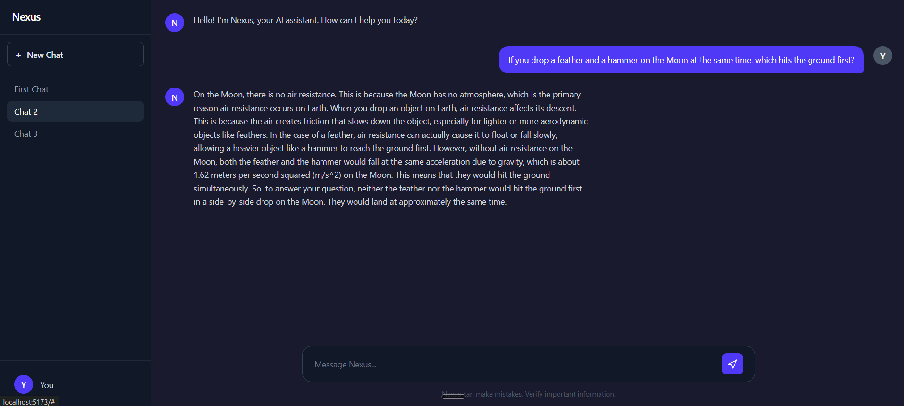

# Nexus

An AI chat application built with React, TypeScript, and the Groq API. Have real-time conversations with an AI assistant, manage multiple chat threads, and persist your conversation history — all client-side.



## 🚀 Live Demo

[View Live Demo](https://nexus-qpcmhtcrj-abedoulaye.vercel.app/)

## ✨ Features

- **Multi-Chat Support** — Create, switch between, and manage multiple conversation threads
- **Real-Time AI Responses** — Powered by Groq's fast inference API with Llama 3.1
- **Persistent Storage** — Conversations saved to localStorage, survive page reloads
- **Dark Theme** — Clean, modern dark interface designed for readability
- **Responsive Layout** — Two-column grid with collapsible sidebar
- **TypeScript** — Fully typed for better developer experience and fewer bugs

## 🛠️ Tech Stack

| Technology   | Purpose             |
| ------------ | ------------------- |
| React        | UI framework        |
| TypeScript   | Type safety         |
| Tailwind CSS | Styling             |
| Groq API     | AI chat completions |
| localStorage | Data persistence    |

## 📦 Installation

1. **Clone the repository**
   ```
   git clone https://github.com/abedoulaye/nexus
   cd nexus
   ```

```

2. Install dependencies
```

npm install

```

3. Set up environment variables

Create a .env file in the project root:
```

VITE_GROQ_API_KEY=your_groq_api_key_here

```
Get your free API key at console.groq.com

4. Start the development server
```

npm run dev

```
5. Open http://localhost:5173 in your browser


## Project Structure
```

text
nexus/
├── src/
│ ├── App.tsx # Main application component
│ ├── main.tsx # Entry point
│ └── index.css # Tailwind imports
├── .env # Environment variables (gitignored)
├── package.json
└── README.md

```

## 🔑 API
This project uses the Groq API with the llama-3.1-8b-instant model. The free tier includes generous usage limits — no credit card required to get started.

## 📝 What I Learned
Managing complex nested state with React's useState

Implementing multi-conversation architecture with chat history

Persisting and hydrating state from localStorage

Integrating third-party AI APIs with proper error handling

Building responsive dark-themed UIs with Tailwind CSS

TypeScript interfaces for nested data structures

📄 License
MIT


---
```
